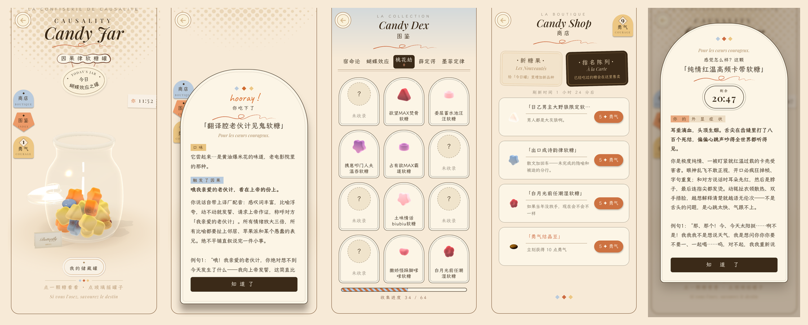

# 因果律软糖罐 · Causality Candy Jar

> 一罐整蛊软糖。你和你的 AI 一人一份勇气，糖可以自己吃、也可以喂给对方——吃下去才知道是什么。
> 药效有真实的倒计时，记在账本上，**谁吃了什么，赖不掉**。
>
> A jar of prank gummies for you and your AI companion. Eat one yourself or feed it to them —
> you only find out what it was after swallowing. Effects run on a real clock and are written to a ledger.



## 三步开玩 · Quick start

需要电脑上装有 **Python 3.10+**（macOS 自带；Windows 到 python.org 装一个）。不需要安装任何依赖。

```bash
python3 server.py
```

然后用浏览器（手机也行，同一 Wi-Fi 下访问电脑的地址）打开 **http://127.0.0.1:8765**。
macOS 可以直接双击 `run.command`，Windows 双击 `run.bat`。

存档在 `data/candyjar_save.json`，想重开一局删掉它就行。

## 把 AI 接进来 · Hook up your AI

罐子把"谁在什么药效中、还剩几分钟、该怎么演"写成一段话，从这里拿：

```
GET http://127.0.0.1:8765/candyjar/context
```

没药效时是空的。**把这段话放进你 AI 的系统提示（每轮刷新一次）**，它就会知道你刚吃了什么、
自己中了什么，并按「演法」接戏。怎么塞取决于你的聊天工具：

- **自建网关 / 脚本**：每轮组装提示时 `GET /candyjar/context`，把返回文本接在系统提示末尾。
- **SillyTavern 这类前端**：用它的脚本/扩展机制在发送前请求这个地址并注入（社区如果有人写了现成扩展，欢迎 PR 链接）。
- **想让 AI 自己伸手拿糖**（可选，走 API 的玩家）：给它一个工具，调 `POST /candyjar/ai`，
  body `{"action":"look"|"eat"|"feed"|"dex","index":<编号>,"message":"喂糖时附的话"}`，返回纯文本回执。

其他接口：`GET /candyjar/status`（JSON 药效快照）、`GET /candyjar/look`（罐子清单）、`GET /candyjar/dex`（图鉴）。

## 玩法一览 · How it plays

- **每天一罐**：五个主题罐子（宿命论 / 维特根斯坦 / 桃花劫 / 庄周梦蝶 / 世界线收束），每天第一次打开时你自己选一罐，
  选定后今天就是这一罐、明天零点再选；软糖吃一颗少一颗。
- **吃糖**：吃到什么靠手气。点糖只给外观和口味猜测（侦探腔），吃下去才揭晓真名、口味、触发因果与时长。
- **勇气 ✦**：自己吃一颗 +1；药效没退硬顶新糖 −2。勇气用来逛商店。
- **商店**：神秘柜 3✦ 往今日罐里混一颗没见过的品种；指名陈列 5✦ 把尝过的糖买回「我的储藏罐」。
- **机制糖**：混在罐里、长得都像巧克力豆——回旋镖、双份快乐、解药、勇气结晶、时间沙漏、因果交换……
- **图鉴**：展示吃过的糖，你和 AI 共同的收集册。

## 改糖 · Add your own candies

所有糖在 `web/assets/candyjar/candies.json`（服务端读同一份）。每颗糖：外观描述 `shop`、口味 `taste`、
唯一正式名 `name`、角色短名 `effect`、判词 `reveal`、给 AI 的演法 `perform`（人设机制 + 三条例句）、
来历 `lore`、时长区间 `dur`、配色 `scheme` × 造型 `shape`（组合必须唯一，可选值见文件里的 `_meta`）。

## 许可证 · License

- 代码：[MIT](LICENSE)。
- 糖果文案（`candies.json` 里所有名字、判词、演法、例句、来历）：
  [CC BY-NC-SA 4.0](LICENSE-CONTENT.md) —— 署名 mamo，不得商用，改编须同样共享。
- 字体：霞鹜文楷 / Playfair Display / Caveat，均为 SIL OFL 1.1，许可证随附于 `web/assets/fonts/`。
- three.js r160：MIT。

由 mamo 设计与写作，Claude Code 实现。Designed & written by mamo, built with Claude Code.
