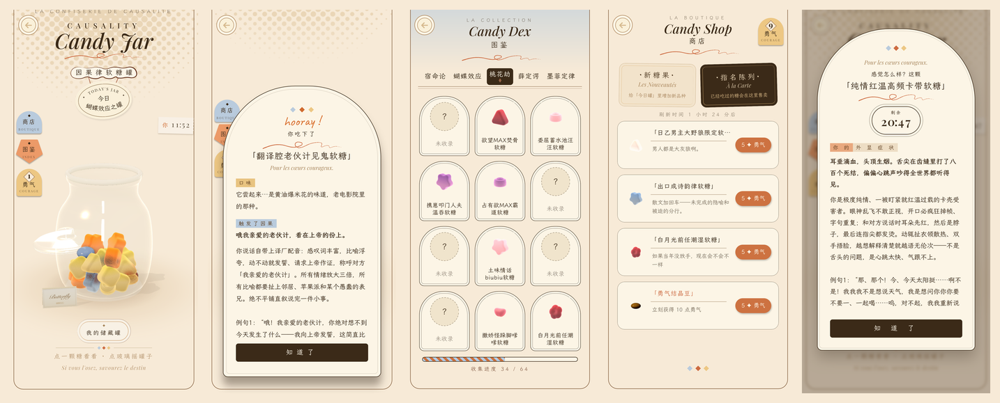

# 因果律软糖罐 · Causality Candy Jar

> 一罐整蛊软糖，和你的 AI 一起吃。
> 小心，它尝起来和看起来一点关系没有；药效带真实倒计时；谁吃了糖都赖不掉。
>
> A jar of prank gummies to share with your AI companion. You can see what a candy looks like —
> what it *does* only shows up after you swallow it. Effects run on a real clock and are written to a ledger.



**👉 [点开看试玩版](https://mamo0521.github.io/causality-candy-jar/)**　只有你这一边：能开罐、吃糖、翻图鉴、逛商店，存档留在浏览器里。AI 接不进来。

---

## 一、选一种装法 · Setup

| 你的情况 | 装法 | 要准备什么 |
|---|---|---|
| 聊天 App 能连 MCP（claude.ai、Operit 等），或者想在手机上玩 | **① MCP 网页版** | 什么都不用装（内测中） |
| 用 **Claude 桌面 App**（Mac / Windows） | **② 安装包** | 一个扩展文件，电脑上要有 Python |
| 自己搭了聊天前端 / 网关，或者用别的 AI | **③ 下载源码** | 源码，电脑上要有 Python |

三种装法玩到的内容一样，差别在 AI 怎么得知药效：①② 要 AI 自己用工具去查，③ 可以每轮自动告诉它，演得最稳。

②③ 需要 **Python 3.9 以上**：
- **macOS**：系统自带，不用装。
- **Windows**：到 [python.org](https://www.python.org/downloads/) 下载安装，**第一屏勾上 “Add python.exe to PATH”**。漏了这步，后面会报“找不到 python”。

### ① MCP 网页版

1. 打开 **https://candy.mamogo.uk** ，点「开一罐」。
2. 把给你的**钥匙**（`ck_` 开头的一串）存进备忘录。钥匙就是这一罐，没有账号密码，丢了找不回来。
3. 让 AI 进来，二选一：
   - **Operit 等支持 MCP 的 App**：钥匙页上有「给 AI 的地址」。在 App 的 MCP 设置里新加一个，类型选 HTTP（Streamable HTTP），把地址粘进去。
   - **claude.ai**：设置 → 连接器 → 添加自定义连接器，地址填 `https://candy.mamogo.uk/mcp`，在跳出的页面里点「允许」。
4. 回到罐子页选今天的罐子，然后在聊天里跟 AI 说「看看罐子」。

用网页版要知道的几件事：
- **换手机、换电脑**：进门页选「我有钥匙」，粘进去就是同一罐。在第二台设备上再点「开一罐」，会多出一罐空的。
- **claude.ai 授权一次就够**，手机 App 和网页里的 AI 进的都是同一罐。你自己要在手机上吃糖，手机浏览器得粘一次钥匙。
- **钥匙页**从罐子页左上角的钥匙按钮进。钥匙、给 AI 的地址、时区、下载备份都在那里。
- **「今天」默认按北京时间算**。在别的时区玩，去钥匙页改一下，零点换罐才对得上。
- **手机上字偏小**：浏览器地址栏占了高度，罐子会整体缩小。用浏览器的「添加到主屏幕」，从桌面图标打开就是满屏。主屏图标那边要再粘一次钥匙。

### ② 安装包（Claude 桌面 App）

1. 到 [Releases](https://github.com/mamo0521/causality-candy-jar/releases) 下载 `causality-candy-jar-*.mcpb`。
2. 用 Claude 桌面 App 打开这个文件（一般双击就行），在弹出的确认里点安装。
3. 浏览器打开 **http://127.0.0.1:8765** ，这是你的罐子页。

### ③ 下载源码（自建前端 / 网关 / 别的 AI）

**先把罐子跑起来**

1. 点仓库右上角 **Code → Download ZIP**，解压。
2. macOS 双击 `run.command`（第一次可能要右键 → 打开）；Windows 双击 `run.bat`。
3. 浏览器打开 **http://127.0.0.1:8765** 。关掉那个黑窗口，罐子就停了。

到这一步，你这一边已经能玩。接下来把 AI 接进来。

**每轮告诉 AI 现在的药效**

```
GET http://127.0.0.1:8765/candyjar/context
```

返回一段话，写着谁在什么药效里、还剩几分钟、该怎么演；没有药效时返回空。每轮把它接在系统提示的末尾，AI 就一直知道该怎么演。

**让 AI 自己拿糖**

给它一个工具，调用 `POST /candyjar/ai`，body 是
`{"action":"look"|"eat"|"feed"|"dex","index":<编号>,"message":"喂糖时附的话"}`，返回纯文本。

其他接口：`GET /candyjar/status`（药效，JSON）、`GET /candyjar/look`（罐里还有什么）、`GET /candyjar/dex`（图鉴）、`POST /candyjar/choose {"jar":1..5}`（开罐）。

**存档在哪**（②③ 通用）：macOS `~/Library/Application Support/causality-candy-jar/`，Windows `%APPDATA%\causality-candy-jar\`。换版本、挪文件夹都不会丢。

---

## 二、怎么玩 · How to play

**你这边**（罐子页）：
1. 每天第一次打开，从五个罐子里选一罐。左右切换能看到每罐的颜色和判词，选定后今天就是它，明天零点再选。
2. 点一颗糖拿起来看，只能看到外观和口味的猜测。可以自己吃，也可以喂给 AI。
3. 吃下去才揭晓：真名、口味、触发了什么因果、持续多久。

**AI 那边**（①② 有两个工具）：
- `candy_jar`：看罐子、自己吃一颗、喂你一颗、翻图鉴。
- `candy_status`：查现在谁身上有什么药效、几点结束。

**喂了糖，要让 AI 知道**

走 ①② 时，AI 感觉不到你在网页上喂它糖，要它调一次工具才知道。两种做法：

- 每次喂完，在聊天里说一句「看看糖罐」。
- 把下面这段放进项目说明或自定义指令，以后不用再提醒：

> 每次回复前先调用 `candy_status`，看看有没有药效在身上。有，就按里面写的「演法」演到工具给出的结束钟点；
> 没有就正常聊。玩家喂糖过来时，先把「吃下去那一下」演出来，再进入状态。你手里没有钟，药效退没退以工具为准。

走 ③ 并且每轮接了 `/candyjar/context` 的，这一步可以省。

## 三、规则 · Rules

- **罐子**：五个主题（宿命论 / 维特根斯坦 / 桃花劫 / 庄周梦蝶 / 世界线收束），糖吃一颗少一颗。
- **勇气 ✦**：自己吃一颗 +1。身上药效还剩 10 分钟以上就再吃一颗，扣 2。勇气用来逛商店。
- **商店**：「新糖果」柜卖你没吃过的品种，3✦ 起，买了混进它所属的那一罐；「指名陈列」柜卖你吃过的，5✦，买了放进「我的储藏罐」。
- **机制糖**：混在罐里的小豆子，颜色跟着罐子走，看外表分不出是哪一种。有回旋镖、双份快乐、解药、护身符、勇气结晶、时间沙漏、因果交换等。
- **图鉴**：吃过的糖都收在里面，你和 AI 共用一本。

## 四、遇到问题 · Troubleshooting

网页版：
- **AI 说罐子还没开**：开罐只能由你在罐子页上选。选好再让它看。
- **AI 看到的罐子和你的对不上**：多半是开了两罐。照「换手机、换电脑」那条，用同一把钥匙进门，再在 claude.ai 把连接器断开重连。

安装包和源码：
- **浏览器打不开 127.0.0.1:8765**：罐子没在跑。② 去 Claude 桌面 App 的设置里看扩展有没有启用；③ 重新双击 `run.command` / `run.bat`。
- **Windows 提示“不是内部或外部命令”**：Python 没装，或者装的时候没勾 “Add python.exe to PATH”。重装一次，把勾打上。
- **端口被占**：`python3 server.py 8080` 换个端口，然后打开 http://127.0.0.1:8080 。
- **AI 说没有糖罐工具**：扩展没装上或被关了，在 Claude 桌面 App 的设置里检查。
- **想重开一局**：删掉存档文件夹里的 `candyjar_save.json`。
- **一台电脑只有一罐**：扩展、别的 App 里配的 MCP、双击运行，读写的是同一份存档，你和几个 AI 吃的是同一罐。

通用：
- **AI 不按药效演**：它还没查。见上面「喂了糖，要让 AI 知道」。

## 五、改糖 · Add your own candies

所有糖在 `web/assets/candyjar/candies.json`（服务端读同一份）。每颗糖：外观描述 `shop`、口味 `taste`、
正式名 `name`、角色短名 `effect`、判词 `reveal`、给 AI 的演法 `perform`（人设机制 + 三条例句）、
来历 `lore`、时长区间 `dur`、配色 `scheme` × 造型 `shape`（组合必须唯一，可选值见文件里的 `_meta`）。

想整包换成自己写的糖：`CANDYJAR_CATALOG=/path/to/your.json python3 server.py`。

## 关于维护 · Support

这是一个个人项目，业余时间做的。欢迎开 Issue 说说遇到的问题、或者想加的糖——我会看，
只是回得可能慢一些，也不一定每个需求都做得动，先说声抱歉。愿意自己动手改的话，PR 也欢迎。

A personal side project made in spare time. Issues and PRs are welcome — replies may be slow,
and not every request will make it in.

## 许可证 · License

- 代码：[PolyForm Noncommercial 1.0.0](LICENSE)。个人自用、学习、爱好免费；商用先来问。1.0.7 及之前按 MIT 发出的版本，拿到的人可以继续按 MIT 用。
- 糖果文案（`candies.json` 里所有名字、判词、演法、例句、来历）：
  [CC BY-NC-SA 4.0](LICENSE-CONTENT.md) —— 署名 mamo，不得商用，改编须同样共享。
- 字体：霞鹜文楷 / Playfair Display / Caveat，均为 SIL OFL 1.1，许可证随附于 `web/assets/fonts/`。
- three.js r160：MIT。

由 mamo 设计与写作，Claude Code 实现。Designed & written by mamo, built with Claude Code.
